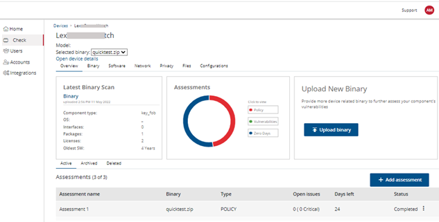

# Getting Started

>##At a glance
>
> **Audience:** New FirmwareCheck users
>
> **Estimated time:** 10–15 minutes
>
> **Prerequisites:** An active FirmwareCheck account or an invitation from an administrator
>
> **Outcome:** You'll be able to sign in, become familiar with the interface, and be ready to create your first device.

---

## Overview

This section helps first-time users gain access to FirmwareCheck, sign in, and become familiar with the application.

Whether you're creating a new account or accepting an invitation from your organization, the topics in this section guide you through the steps required to access FirmwareCheck and prepare for your first firmware assessment.

After completing this section, you'll be ready to manage your account, create a device, upload firmware, and run an assessment.

---

## Get access to FirmwareCheck

There are two ways to gain access to FirmwareCheck. Choose the option that matches your situation.

| If you... | Go to |
|------------|-------|
| Don't have a FirmwareCheck account | Register a new account |
| Received an invitation from your organization | Accept an invitation |

### Register a new account

Use this procedure to create a new FirmwareCheck account if your organization allows self-registration.

#### Before you begin

- Use a valid business email address.
- Ensure that you can access the confirmation email sent during registration.

#### To register a new account

If this is your first time using FirmwareCheck, you'll register yourself and create a username and password.

**To register and sign in for the first time:**

1. Go to the FirmwareCheck sign-in page (`https://app.firmwarecheck.io/signup`).
2. Click **Register**.
3. On the **FirmwareCheck — Registration** dialog, enter your business email and company name.
4. Click **Submit**.

    You'll receive an email from FirmwareCheck with a link to complete registration.

    !!! note
        The confirmation link is valid for 24 hours. If it doesn't show up in your inbox, check your spam or junk folder.

    
    *Figure 1: Signing in to FirmwareCheck for the first time*

5. Open the confirmation email and click the link inside it. This opens the registration window in your browser.
6. On the **New account set-up** page:
      1. **Configure user** — enter your first name, last name, and company role, then click **Next**.
      2. **Set password**, then click **Next**.
      3. **Select industry**, then click **Finish**.

    
    *Figure 2: Completing the registration process*

Once your account is created, you'll move to the next step, where you can [invite other users](#manage-users) — colleagues or teammates. You can skip this and come back to it later.

From here you can:

- [Update your profile](#update-your-profile)
- [Change your display name](#change-your-display-name)
- [Change the industry on your profile](#change-the-associated-industry-on-your-profile)
- [Invite a new user](#manage-users)

### Accept an invitation

Use this procedure if a FirmwareCheck administrator has invited you to join an existing organization. 
Your manager/colleagues with Binary Check access can invite you to use the application. They can nominate you either as a user or an administrator of an account.

#### Before you begin

- Ensure that you can access the invitation email sent by your administrator.
- Complete the registration within the validity period specified in the invitation email.

#### To accept an invitation

1. Click the access link in the invitation email.

    !!! note
        The invitation link is valid for 24 hours.

2. On the **New account set-up** page:
      1. **Configure user** — enter your first name, last name, and company role, then click **Next**.
      2. **Set password**, then click **Next**.
      3. **Select industry**, then click **Finish**.

Once your account is created, you'll be able to:

- [Update your profile](#update-your-profile)
- [Change your display name](#change-your-display-name)
- [Change the industry on your profile](#change-the-associated-industry-on-your-profile)
- [Invite a new user](#manage-users)

!!! tip

    If the invitation link has expired, contact your organization's FirmwareCheck administrator and request a new invitation.
---

## Sign in to FirmwareCheck
Use this procedure to sign in to FirmwareCheck after your account has been created.

#### Before you begin

- Ensure that your account has been activated.
- Have your registered email address and password available.

#### To sign in

1. Open the FirmwareCheck sign-in page.

2. Type your email address.

3. Type your password.

4. Click **Sign In**.

The FirmwareCheck dashboard opens.

!!! note

    If you've forgotten your password, see
    **Reset your password**.

---

## Reset your password

Use this procedure if you've forgotten your password and can't sign in to FirmwareCheck.
#### To reset your password
1. Go to the FirmwareCheck sign-in page.
2. Click **Forgot your password?**
3. On the **Forgot password** dialog, enter your email.
4. Click **Reset password**.

    You'll get an email with a password recovery link. Click it to open the **Password reset** page.

    !!! note
        The recovery link is valid for 24 hours. If it doesn't show up in your inbox, check your spam or junk folder.

5. On the **Password reset** page, enter your new password and click **Finish**.

---

## Understand the dashboard

After you sign in, the FirmwareCheck dashboard opens. The dashboard provides access to device management, firmware assessments, user administration, integrations, and account settings.

The interface is organized into several areas that remain consistent throughout the application.

*Figure 1. FirmwareCheck dashboard.*

### Main navigation

Use the navigation pane on the left to access the main areas of FirmwareCheck.

| Menu | Purpose |
|------ | --------|
| Home | View dashboard information, recent activity, and assessment summaries. |
|FirmwareCheck | Create and manage devices, firmware, and run assessments. |
| Users | Invite users and manage roles (administrators only). |
| Integrations | Configure third-party integrations such as Jira. |

### Workspace

The workspace displays the page you're currently working on.

As you navigate through FirmwareCheck, the workspace updates to show the selected feature, such as devices, assessments, or reports.

### Notifications and user menu

The upper-right corner of the dashboard provides access to notifications and your user account.

From the user menu, you can:

- Update your profile.
- Change your password.
- Sign out.

## Next steps

Now that you're familiar with the FirmwareCheck interface, you're ready to begin working with devices.

Continue with one of the following tasks:

- [Manage your account](manage-your-account.md)
- [Manage devices](manage-devices.md)

## Related tasks

- [Reset your password](getting-started.md#reset-your-password)
- [Manage users](manage-users.md)