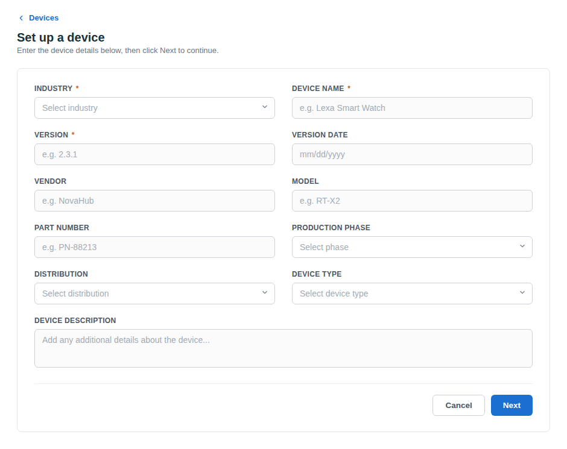

# Create a device

Create a device record before uploading firmware or running assessments.

### When to use this

Use this procedure when you want to assess a new product or track a new firmware version in FirmwareCheck.

### Before you begin

- Sign in to FirmwareCheck. For instructions, see [How to sign in](../getting-started.md#how-to-sign-in).
- Understand what a device represents. See [What is a device?](what-is-a-device.md).

## To create a Device:

1. In the navigation pane, click **FirmwareCheck**.

2. Click  **Home** on the left-hand panel, then click **+ Add new device**.

3. On the **Set up a device** page, fill in the following fields.

    | Field | Description |
    |---|---|
    | Industry | The industry the device belongs to |
    | Device name | Name of the device |
    | Version | Current version of the device |
    | Version date | Date this version was completed or revised |
    | Vendor | Name of the vendor |
    | Model | Model name assigned to the device |
    | Part number | Part number assigned to the device |
    | Production phase | Phase the device is currently in |
    | Distribution | Distribution option, selected from a list |
    | Device type | Type of device, selected from a list |
    | Device description | Any additional details about the device |

*Figure 1: Create a Device*

4. Review the information.

5. Click **Save**.

The device is added to your workspace and is ready for firmware uploads and assessments.

!!! tip

    Use a consistent naming convention for device records. Including the product name, model, and firmware version makes devices easier to locate as your workspace grows.

## Next steps

Continue with one of the following tasks:

- [Upload firmware](../manage-firmware/upload-firmware.md)
- [Find a device](find-a-device.md)

## Related tasks

- [Update device information](update-device-information.md)
- [Archive a device](archive-a-device.md)