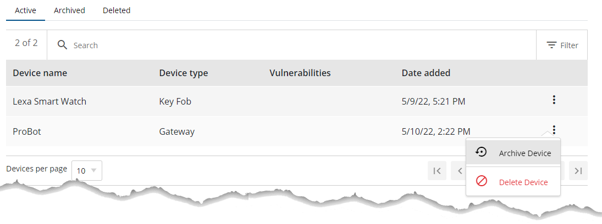
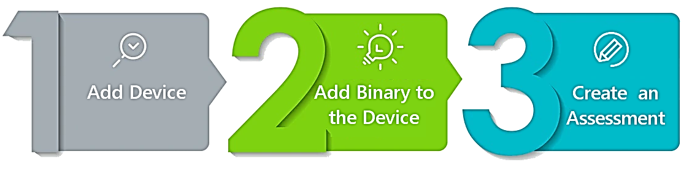

# Update device information

Update a device record to keep its information accurate and up to date.

## Before you begin

- Sign in to FirmwareCheck.
- Locate the device you want to update. For more information, see
  [Find a device](find-a-device.md).

### Archive a device

1. On the left-hand panel, click **FirmwareCheck**. FirmwareCheck shows all devices with **Active** status.
2. Click the **More options** icon on the device whose status you want to change.
3. Click **Archive device**.

    Device list with the archive device confirmation dialog open.
    
    *Figure 5: Archiving a device*

4. On the **Archive device** dialog, click **Yes**.

    The device now appears under the **Archived** tab.

### Delete a device

1. On the left-hand panel, click **FirmwareCheck**. FirmwareCheck shows all devices with **Active** status.
2. Click the **More options** icon on the device whose status you want to change.
3. Click **Delete device**.

    
    *Figure 6: Deleting a device*

4. On the **Delete device** dialog, click **Yes**.

    The device now appears under the **Deleted** tab.

## Add firmware to a device

1. On the left-hand panel, click **FirmwareCheck**. FirmwareCheck shows all devices with **Active** status.
2. Click the device you want to upload firmware to.
3. Click **Upload firmware**.

Add firmware to the device panel, showing the upload firmware action

*Figure 7: Adding firmware to a device*
## View details of a device

FirmwareCheck gives you detailed information on every active device. To open it, click **FirmwareCheck** on the left-hand panel and select the device you want to review.

Device information is organized into tabs:

| Tab | Description |
|---|---|
| Overview | High-level summary of the device |
| Firmware | List of firmware file(s) uploaded for the device |
| Software | SBOM, licensing, cryptography, and URLs |
| Network | Interfaces, IPs, MAC addresses, and firewalls |
| Privacy | Personally identifiable information (PII): email addresses, phone numbers, SSNs |
| Files | Extracted binary file contents |
| Configurations | Credentials, web servers, and general/device-security/vendor-practice settings |

### Overview tab

High-level details of the device as defined in the application.

### Firmware tab

Shows details of the firmware file(s) uploaded for the device:

- Firmware name
- Version
- Date uploaded
- Scan status

### Software tab

Software-related information, organized into:

1. **Software Bill of Materials (SBOM)** — software components and their version numbers.
2. **Licenses** — detected software licenses, with additional detail on each.
3. **Cryptography** — identified encryption keys:
      - **Private key** — used to both encrypt and decrypt data. Typically shared only between sender and receiver.
      - **Public key** — used only to encrypt data, and free to share.
4. **URLs** — URLs associated with the device.

### Network tab

Network-related information, organized into:

1. **Interfaces** — detected network and logical interfaces, including IPs and MAC addresses.
2. **Firewalls** — Windows Firewall configuration, detected automatically from the Windows registry.

### Privacy tab

Personally identifiable information (PII) detected on the device:

- Email addresses
- Phone numbers
- SSNs

### Configurations tab

Component configuration information, organized into:

1. **Credentials**
2. **Web servers**
3. **General** — device labeling, documentation, and resilience settings, configured by selecting the statements that apply to the device.
4. **Device security** — authentication, software updates, secure data storage, communications, software, secure memory, setup and maintenance, device safety, endpoint protection, and identity, configured the same way.
5. **Vendor practices** — general, process, and policy statements that apply to the vendor.

## Next steps

Continue with one of the following tasks:

- [Upload firmware](../manage-firmware/upload-firmware.md)
- [Run an assessment](../run-assessments/run-an-assessment.md)

## Related tasks

- [Find a device](find-a-device.md)
- [Archive a device](archive-a-device.md)