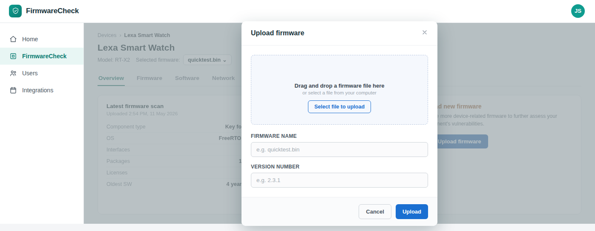

# Upload firmware

Upload a firmware image to a device before running security or compliance assessments.

## Before you begin

- Sign in to FirmwareCheck.
- Create a device. For more information, see
  [Create a device](../manage-devices/create-a-device.md).
- Locate the device that will contain the firmware. For more information, see
  [Find a device](../manage-devices/find-a-device.md).

## To upload firmware:

1. In the navigation pane, click **FirmwareCheck**.

2. Open the device to which you want to upload firmware.

3. Click **Upload firmware**.

*Figure 1: Upload Firmware*

4. Select the firmware image from your computer.

5. Review the firmware information.

6. Click **Upload**.

FirmwareCheck uploads the firmware image and associates it with the selected device.

!!! note

    Uploading a firmware image does not automatically start an assessment. After the upload is complete, run an assessment to analyze the firmware.

!!! tip

    Verify that you are uploading the correct firmware version before starting an assessment. Using a consistent versioning scheme makes it easier to compare assessment results over time.

## Next steps

Continue with one of the following tasks:

- [Run an assessment](../run-assessments/run-an-assessment.md)
- [Replace firmware](replace-firmware.md)

## Related tasks

- [What is firmware?](what-is-firmware.md)
- [Create a device](../manage-devices/create-a-device.md)