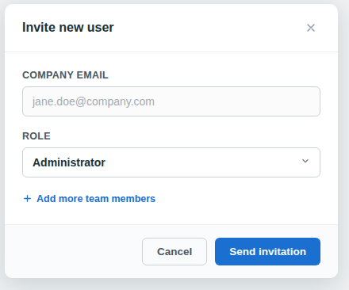
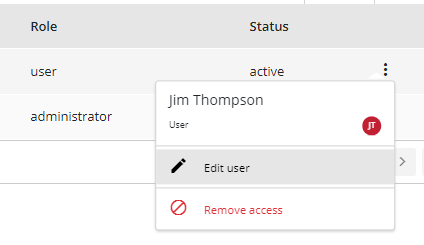
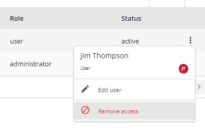

---

icon: material/account-multiple-outline

---

# Manage users

Administrators manage user access by inviting users, assigning roles, and removing users from the FirmwareCheck workspace.

You can share access to FirmwareCheck with other people, such as business partners and employees, and give them either of two levels of access. 

You can also remove access at any time.

**Types of user roles**

- **Administrators**: Users with this role can add and manage all users, and password-related operations. They can view all the sessions and passwords that were created.

- **Standard User** have all the privileges of an administrator except for managing users. They do not have any permissions relating to other users. They are allowed to access the records and reports.

## At a glance

**Audience:** Administrators

In this section, you'll learn how to:

- Invite a user.
- Change a user's role.
- Remove a user.

## Before you begin

- Sign in to FirmwareCheck. For instructions, see [Sign in to FirmwareCheck](getting-started.md#how-to-sign-in).
- Ensure that you have the **Administrator** role.

!!! note

    Only users with the **Administrator** role can manage other users.
 
## Invite a user

Invite a colleague to access your organization's FirmwareCheck workspace.

### When to use this

Use this procedure when a new team member requires access to FirmwareCheck.

### To invite a user:

1. Sign in to your FirmwareCheck account.
2. On the left-hand panel, click **Users**.
3. In the top-right corner, click **Invite new user**.
4. On the **Invite new user(s)** dialog:
      - Enter the company email address.
      - Select a role.
      - To add another user, click **Add more team members**.
5. Click **Invite**.
FirmwareCheck sends an invitation email to the specified email address.
 
  
  *Figure 1: Invite a user*  
!!! note

    The invited user must accept the invitation before they can sign in to FirmwareCheck.

## Change a user's role

Change a user's role to grant or restrict access to FirmwareCheck features.

### When to use this

Use this procedure when a user's responsibilities change and they require additional or reduced permissions.

### To change a user's role:

1. 1. Sign in to your FirmwareCheck admin account.
2. On the left-hand panel, click **Users**.
3. From the table, select the user whose role you want to change.
4. Click the  **More options** icon.
5. Click **Edit user**.

    

    *Figure 3: Changing a user's role*

6. On the **Edit user** dialog, select the new role.
7. Click **Save**.

FirmwareCheck immediately applies the updated permissions.

!!! warning

    Changing a user's role affects what they can access the next time they use FirmwareCheck.

For more information about user roles, see **Invite a user**.

## Remove a user

Remove a user who no longer requires access to the FirmwareCheck workspace.

!!! note
    Only users with **active** status can be removed.

### When to use this

Use this procedure when a user leaves your organization or no longer requires access to FirmwareCheck.

### Before you begin

- Sign in to FirmwareCheck. For instructions, see [How to sign in](getting-started.md#how-to-sign-in).
- Ensure that you have the **Administrator** role.

### Procedure

1. Sign in to your FirmwareCheck admin account.
2. On the left-hand panel, click **Users**.
3. From the table, select the user you want to remove.
4. Click the **More options** icon.

    

    *Figure 4: Removing a user*

5. Click **Remove access**.
6. You'll see a warning that the user's account and access will be deleted.
7. Click **Yes** to confirm.

## Next steps

Now that you've managed user access, you can continue with one of the following tasks:

- [Manage devices](manage-devices.md)
- [Manage assessments](manage-assessments.md)

## Related tasks

- [Manage your account](manage-your-account.md)
- [Get access to FirmwareCheck](getting-started.md#get-access-to-firmwarecheck)