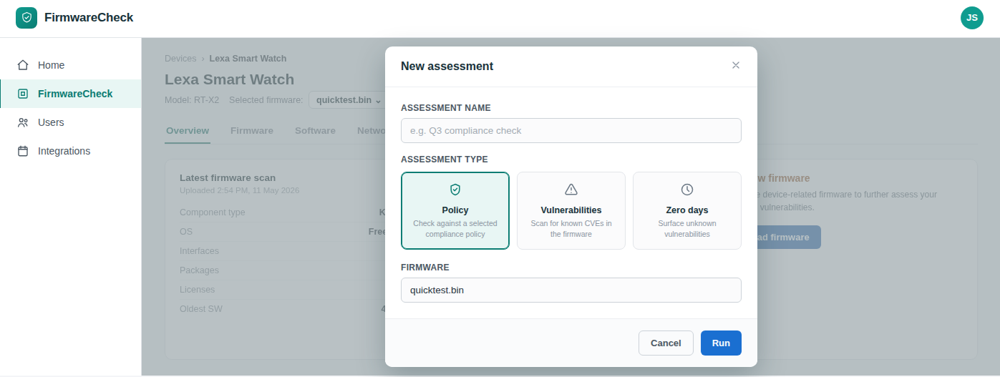

# Run an assessment

Run an assessment to analyze a firmware image for security vulnerabilities, compliance issues, and potential zero-day risks.

## Before you begin

- Create a device. For more information, see
  [Create a device](../manage-devices/create-a-device.md).
- Upload a firmware image. For more information, see
  [Upload firmware](../manage-firmware/upload-firmware.md).
- Understand the available assessment types. For more information, see
  [Assessment types](assessment-types.md).
## To run an assessment:
1. In the navigation pane, click **FirmwareCheck**.

2. Open the device that contains the firmware you want to assess.

3. Select the firmware image.

4. Click **Run assessment**.

5. Select one or more assessment types:

    - **Vulnerability assessment**
    - **Policy assessment**
    - **Zero-day assessment**

6. If applicable, configure additional assessment options.

7. Click **Run**.

FirmwareCheck queues the assessment and begins analyzing the selected firmware image.

!!! note

    Assessment duration depends on factors such as firmware size, assessment type, and system workload.

!!! tip

    Running multiple assessment types provides a more comprehensive view of the firmware's security posture.

## Monitor assessment progress

While the assessment is running, you can monitor its status from the **Assessments** page.

Typical assessment statuses include:

- **Queued**
- **Running**
- **Completed**
- **Failed**

## Next steps

Continue with one of the following tasks:

- [View assessment results](view-assessment-results.md)
- [Generate reports](../reports.md)

## Related tasks

- [Assessment types](assessment-types.md)
- [Upload firmware](../manage-firmware/upload-firmware.md)