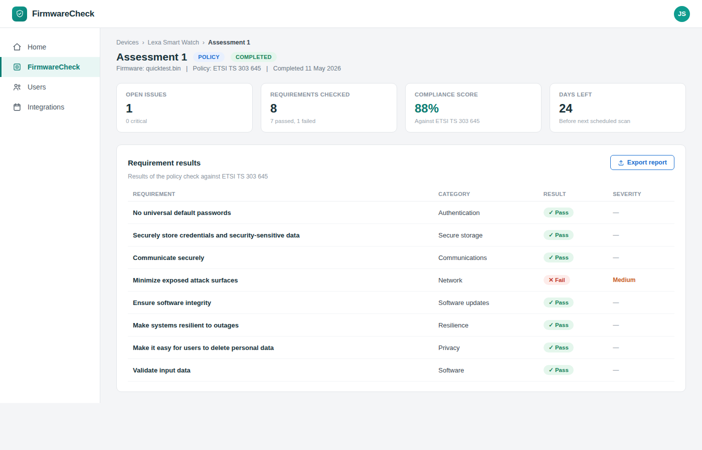

# View assessment results

Review assessment results to understand the security, compliance, and software composition of the selected firmware.

## Before you begin

- Run an assessment. For more information, see
  [Run an assessment](run-an-assessment.md).

## To view assessment results:
1. In the navigation pane, click **FirmwareCheck**.

2. Open the device.

3. Select the firmware image.

4. Open the completed assessment.

*Figure: The assessment dashboard displays the available findings.*

## Assessment summary

The assessment dashboard provides an overview of the firmware, including:

- Overall assessment status
- Security findings
- Compliance status
- Software Bill of Materials (SBOM)
- Risk summary

Use the summary to determine whether additional investigation is required.

## Review findings

Depending on the assessment type, you can review information such as:

### Vulnerabilities

Review:

- CVE identifier
- Severity
- Affected software component
- Available remediation information

### Compliance

Review:

- Standards evaluated
- Passed requirements
- Failed requirements
- Recommendations

### Software inventory

Review:

- Software components
- Component versions
- Open-source licenses
- Dependency information

!!! tip

    Prioritize remediation by addressing Critical and High severity vulnerabilities before lower-risk findings.

## Next steps

Continue with one of the following tasks:

- [Generate reports](../reports.md)
- [Create Jira issues](../jira-integration.md)

## Related tasks

- [Run an assessment](run-an-assessment.md)
- [Assessment types](assessment-types.md)