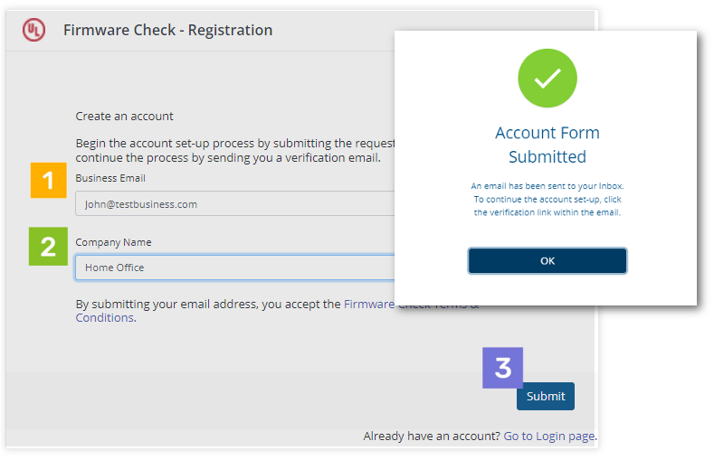
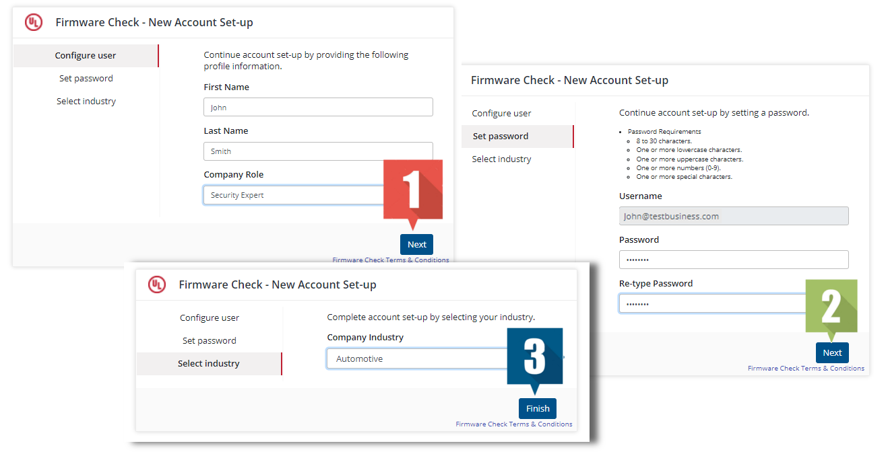

# Getting started

Learn how to access FirmwareCheck, set up your account, and manage other users on your team.

## Your account in FirmwareCheck

### How to sign in to FirmwareCheck

To sign in to FirmwareCheck, you need a username and password. If you don't have them yet, you'll need to register first. See:

- [Sign in for the first time](#sign-in-for-the-first-time)
- [Sign in after receiving an invitation email](#sign-in-after-receiving-an-invitation-email)

### Sign in for the first time

If this is your first time using FirmwareCheck, you'll register yourself and create a username and password.

**To register and sign in for the first time:**

1. Go to the FirmwareCheck sign-in page (`https://app.firmwarecheck.io/signup`).
2. Click **Register**.
3. On the **FirmwareCheck — Registration** dialog, enter your business email and company name.
4. Click **Submit**.

    You'll receive an email from FirmwareCheck with a link to complete registration.

    !!! note
        The confirmation link is valid for 24 hours. If it doesn't show up in your inbox, check your spam or junk folder.

    
    *Figure 1: Signing in to FirmwareCheck for the first time*

5. Open the confirmation email and click the link inside it. This opens the registration window in your browser.
6. On the **New account set-up** page:
      1. **Configure user** — enter your first name, last name, and company role, then click **Next**.
      2. **Set password**, then click **Next**.
      3. **Select industry**, then click **Finish**.

    
    *Figure 2: Completing the registration process*

Once your account is created, you'll move to the next step, where you can [invite other users](#manage-users) — colleagues or teammates. You can skip this and come back to it later.

From here you can:

- [Update your profile](#update-your-profile)
- [Change your display name](#change-your-display-name)
- [Change the industry on your profile](#change-the-associated-industry-on-your-profile)
- [Invite a new user](#manage-users)

### Sign in after receiving an invitation email

A colleague or manager with FirmwareCheck access can invite you to the application, either as a standard user or an administrator. Once you receive the invitation email, setup takes just a couple of minutes.

**To accept an invitation:**

1. Click the access link in the invitation email.

    !!! note
        The invitation link is valid for 24 hours.

2. On the **New account set-up** page:
      1. **Configure user** — enter your first name, last name, and company role, then click **Next**.
      2. **Set password**, then click **Next**.
      3. **Select industry**, then click **Finish**.

Once your account is created, you'll be able to:

- [Update your profile](#update-your-profile)
- [Change your display name](#change-your-display-name)
- [Change the industry on your profile](#change-the-associated-industry-on-your-profile)
- [Invite a new user](#manage-users)

## Manage your account

### Change your password

Use this if you're already signed in and want to change a password you know.

1. Sign in to your FirmwareCheck account.
2. Click the user icon (the circle with your initials) in the top-right corner.
3. From the pop-up dialog, click **Profile**.
4. On the **Profile** dialog, click **Change password**.

    You'll get an email with a password recovery link. Click it to open the **Password reset** page.

    !!! note
        The recovery link is valid for 24 hours. If it doesn't show up in your inbox, check your spam or junk folder.

5. On the **Password reset** page, enter your new password and click **Finish**.

### Sign-in issues

Can't sign in? A few things are usually the cause: a forgotten password, a forgotten username, or an account that's been locked or deleted.

For password problems, see [Password reset and recovery](#password-reset-and-recovery).

### Password reset and recovery

Use this to reset a forgotten password.

1. Go to the FirmwareCheck sign-in page.
2. Click **Forgot your password?**
3. On the **Forgot password** dialog, enter your email.
4. Click **Reset password**.

    You'll get an email with a password recovery link. Click it to open the **Password reset** page.

    !!! note
        The recovery link is valid for 24 hours. If it doesn't show up in your inbox, check your spam or junk folder.

5. On the **Password reset** page, enter your new password and click **Finish**.

### Change a known password

Use this to change a password you already know. If you've forgotten it instead, see [Password reset and recovery](#password-reset-and-recovery).

1. Sign in to your FirmwareCheck account.
2. Click the user icon in the top-right corner.
3. Click **Profile**.
4. On the **Profile** dialog, click **Change password**.

    You'll get an email with a password recovery link. Click it to open the **Password reset** page.

    !!! note
        The recovery link is valid for 24 hours. If it doesn't show up in your inbox, check your spam or junk folder.

5. On the **Password reset** page, enter your new password and click **Finish**.

### Update your profile

#### Change your display name

1. Sign in to your FirmwareCheck account.
2. Click the user icon in the top-right corner.
3. Click **Profile**.
4. On the **Profile** dialog, edit your first name or surname.
5. Click **Save**.

#### Change the associated industry on your profile

1. Sign in to your FirmwareCheck account.
2. Click the user icon in the top-right corner.
3. Click **Profile**.
4. From the **Industry** list, choose the industry you want on your account.
5. Click **Save**.

## Manage users

You can give business partners and employees access to FirmwareCheck at one of two access levels. Users with access can help run your account and, depending on their role, manage other users. You can revoke access at any time.

**User roles:**

- **Administrator** — can add and manage all users and handle password-related operations. Administrators can also view all sessions and passwords created.
- **Standard user** — has every administrator privilege except user management. Standard users can access records and reports but can't manage other users.

### Invite a new user

1. Sign in to your FirmwareCheck account.
2. On the left-hand panel, click **Users**.
3. In the top-right corner, click **Invite new user**.
4. On the **Invite new user(s)** dialog:
      - Enter the company email address.
      - Select a role.
      - To add another user, click **Add more team members**.
5. Click **Invite**.

### Change user role

Only administrators can change user roles. You can assign a role either while [inviting a new user](#manage-users) or by editing an existing user's profile while signed in as an administrator.

**To change a user's role:**

1. Sign in to your FirmwareCheck admin account.
2. On the left-hand panel, click **Users**.
3. From the table, select the user whose role you want to change.
4. Click the **More options** icon.
5. Click **Edit user**.

    
    *Figure 3: Changing a user's role*

6. On the **Edit user** dialog, select the new role.
7. Click **Save**.

### Remove or delete a user

Administrators can revoke access by removing users from the account. Once removed, a user can no longer sign in to FirmwareCheck.

!!! note
    Only users with **active** status can be removed.

**To remove a user:**

1. Sign in to your FirmwareCheck admin account.
2. On the left-hand panel, click **Users**.
3. From the table, select the user you want to remove.
4. Click the **More options** icon.

    
    *Figure 4: Removing a user*

5. Click **Remove access**.
6. You'll see a warning that the user's account and access will be deleted.
7. Click **Yes** to confirm.

## See also

- [FirmwareCheck overview and FAQs](index.md)
- [Managing devices](managing-devices.md)
- [Assessments](assessments.md)
