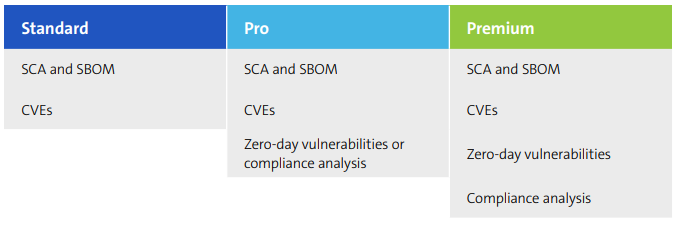

# FirmwareCheck user guide

> *Work sample — This is a technical documentation portfolio piece. It is adapted and rewritten from a production user guide, originally authored for a proprietary firmware security scanning platform; product names, screenshots, and identifying details have been genericized for public sharing.*
>

## About FirmwareCheck

FirmwareCheck is built for product security and development teams at device manufacturers, suppliers, and system integrators who are developing connected products and want to speed up their firmware security review process.

The platform scans firmware binaries for vulnerabilities and checks a product's security and compliance posture against current standards and regulations. It's used across the automotive, healthcare, manufacturing, and consumer IoT industries.

### Firmware security analysis and reporting

FirmwareCheck runs a security check on a firmware binary and generates a report built from whichever of these elements you need:

- Software Composition Analysis (SCA) and Software Bill of Materials (SBOM) generation
- Known vulnerabilities (CVEs)
- Unknown vulnerabilities (zero-day vulnerabilities)
- Compliance analysis against a range of supported standards and guidelines, including an IoT security rating framework, ETSI TS 303 645, ISO/SAE 21434, and IEC 62443-4-1 / 62443-4-2

### How FirmwareCheck works

FirmwareCheck offers three service plans — Standard, Pro, and Premium — with the option to purchase one scan, four scans, or twelve scans depending on your needs.

## Frequently asked questions

Click a question to expand it. Click again to collapse it.

??? question "How do I purchase and use FirmwareCheck scans?"
    Product security and development teams can self-register on the platform and choose a plan based on their needs.

    1. Register and create a [FirmwareCheck account](getting-started.md#sign-in-for-the-first-time).
    2. Once you're signed in, start a FirmwareCheck project from the **Projects** tab and choose a scan package:
          - One firmware scan
          - Four firmware scans
          - Twelve firmware scans
    3. From the project page, download the order form and select a scan package type — Standard, Pro, or Premium.
    4. Upload the completed order form along with the firmware file(s) to scan.
    5. Your report is delivered once the order has been processed.

??? question "What architectures, operating systems, and software frameworks are supported?"
    | Category | Supported |
    |---|---|
    | Architectures | Intel x86/x64 · ARM Cortex-M, -A, -R · PowerPC, PowerPC VLE · NVIDIA AGX Xavier · Renesas RH850, V850, SuperH · Infineon TriCore · MIPS · NXP |
    | Operating systems | Standard Linux distributions · Automotive Grade Linux (AGL) · Android · QNX · Windows server and client (XP, 2016, 2019) · Windows Mobile · NetBSD · FreeBSD · FreeRTOS · Proprietary RTOS · RIOT · Fuchsia OS · OSEK OS · VxWorks · Containers (Docker save, `/var/lib/docker`) |
    | Software frameworks | AUTOSAR |

??? question "What kind of files can I upload to a FirmwareCheck project?"
    You can upload a firmware archive or a single firmware binary file.

??? question "What compression and archive formats are supported?"
    7-Zip (.7z) · AR archive · ARJ (.arj) · Base64 · bzip2 (.bz2) · Compress (.Z) · cpio (.cpio) · DEFLATE · Electron archive (.asar) · Gzip (.gz) · OTF · Pack200 (.jar) · PLF · RAR (.rar) · rzip · TAR (.tar) · UPX (.exe) · XAR (.xar) · lrzip · LZ4 (.lz4) · XZ (.xz) · ZIP (.zip, .jar, .apk, and others) · StuffIt · Zstandard (.zst) · LZH (.lzh) · lzip · LZMA (.lz) · lzop

??? question "What firmware file formats are supported?"
    Android OTA file · Intel HEX / SREC (SRECORD, S19, S28, S37) · ODX · U-Boot Ambarella (.a9s, .a9h, romfs) · TP-Link WR702n image · TRX UEFI binary · VBF · VxWorks ROS · Xerox DLM · eMMC dump, and several OEM-specific formats.

??? question "Where do the vulnerability sources come from?"
    FirmwareCheck draws on a range of public and industry sources, including Auto-ISAC, package bug trackers, the China National Vulnerability Database (CNVD) and its information-security counterpart (CNNVD), Exploit Database, ICS-CERT, Japan Vulnerability Notes (JVN and JVN iPedia), Metasploit, MITRE, the National Vulnerability Database (NVD), Packet Storm, SecuriTeam, SecurityFocus, and the Zero Day Initiative.

??? question "How are unknown vulnerabilities detected?"
    Unknown vulnerabilities are surfaced through reverse engineering and dynamic binary code analysis. They're identified from private analysis rather than pulled from an external feed, so they won't show up in any public database.

??? question "What policies, guidelines, and standards are supported for compliance analysis?"
    | Category | Standards |
    |---|---|
    | General security | SANS Top 25 · 2020 CWE Top 25 · OWASP Top Ten 2017 · Singapore CLS · Backdoor analysis |
    | Secure coding | MISRA C:2012 · CERT C 2016 / AUTOSAR C++14 · IPA ESCR C 3.0 · High Integrity C++ (HIC++) · JSF AV C++ · BARR-C:2018 |
    | Legal and privacy | GDPR |
    | Consumer IoT | ETSI TS 303 645 · CA Senate Bill No. 327 · Oregon House Bill 2395 |
    | Automotive standards | ISO/SAE 21434 · UNECE WP.29 · UNECE WP.29 Annex 5B |
    | Automotive best practices | ENISA automotive security practices |
    | Medical devices | FDA/Medical Devices (draft, October 2018) |
    | Industrial IoT | IEC 62443-3-3 · IEC 62443-4-1 · IEC 62443-4-2 |

## See also

- [Getting started](getting-started.md) — create your account and manage users
- [Managing devices](managing-devices.md) — add devices and upload firmware
- [Assessments](assessments.md) — run a policy, vulnerability, or zero-day assessment
- [Jira integration](jira-integration.md) — connect FirmwareCheck to Jira
