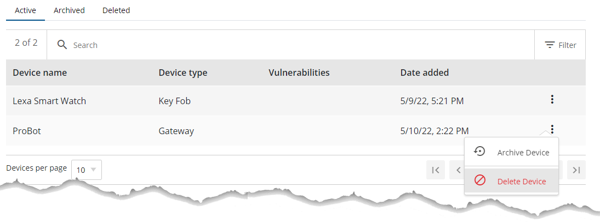

# Managing devices

This section covers how product security and development teams run a security and compliance check on device firmware. FirmwareCheck supports three types of assessments:

- Policy assessment
- Vulnerability assessment
- Zero-day assessment

To run an assessment, work through these steps in order:

1. [Add a device](#add-or-create-a-device)
2. [Add firmware to the device](#add-firmware-to-a-device)
3. [Create an assessment](assessments.md#create-an-assessment)

## What is a device

In FirmwareCheck, a device is an entity you create to hold information about the physical hardware whose firmware you want to assess. Once you've created a device, you upload its firmware binary to run a security and compliance check.

A device also stores several component attributes:

- Software configuration
- SBOM — software packages and licensing
- Credentials
- Application configurations, such as web servers

**In this section:**

- [Add a new device](#add-or-create-a-device)
- [Change the status of a device](#change-status-of-a-device)
- [Add firmware to a device](#add-firmware-to-a-device)
- [View device details](#view-details-of-a-device)

## Device status

When you create a device, FirmwareCheck assigns it **Active** status by default. A device can have one of three statuses:

- Active
- Archived
- Deleted

## Add or create a device

There are two ways to add a device:

- From the **Device list** page — click **FirmwareCheck** on the left-hand panel.
- From the **Home** page — click **Home** on the left-hand panel, then click **+ Add new device**.

**To set up a device:**

1. On the **Set up a device** page, fill in the following fields.

    | Field | Description |
    |---|---|
    | Industry | The industry the device belongs to |
    | Device name | Name of the device |
    | Version | Current version of the device |
    | Version date | Date this version was completed or revised |
    | Vendor | Name of the vendor |
    | Model | Model name assigned to the device |
    | Part number | Part number assigned to the device |
    | Production phase | Phase the device is currently in |
    | Distribution | Distribution option, selected from a list |
    | Device type | Type of device, selected from a list |
    | Device description | Any additional details about the device |

2. After filling in the required fields, click **Next**. FirmwareCheck shows a success message and creates the device.

**See also:** [View existing devices](#view-existing-devices)

## View existing devices

The **Device list** page shows every device created by the current user, filterable by status: Active, Archived, or Deleted. You can also create a new device from this page by clicking **Create device**.

**To view existing devices:**

1. On the left-hand panel, click **FirmwareCheck**. By default, FirmwareCheck shows all devices with **Active** status.
2. To see devices with a different status, click the **Archived** or **Deleted** tab.

**See also:** [Add a device](#add-or-create-a-device)

## Change status of a device

### Archive a device

1. On the left-hand panel, click **FirmwareCheck**. FirmwareCheck shows all devices with **Active** status.
2. Click the **More options** icon on the device whose status you want to change.
3. Click **Archive device**.

    
    *Figure 5: Archiving a device*

4. On the **Archive device** dialog, click **Yes**.

    The device now appears under the **Archived** tab.

### Delete a device

1. On the left-hand panel, click **FirmwareCheck**. FirmwareCheck shows all devices with **Active** status.
2. Click the **More options** icon on the device whose status you want to change.
3. Click **Delete device**.

    
    *Figure 6: Deleting a device*

4. On the **Delete device** dialog, click **Yes**.

    The device now appears under the **Deleted** tab.

## Add firmware to a device

1. On the left-hand panel, click **FirmwareCheck**. FirmwareCheck shows all devices with **Active** status.
2. Click the device you want to upload firmware to.
3. Click **Upload firmware**.

*Figure 7: Adding firmware to a device*

## View details of a device

FirmwareCheck gives you detailed information on every active device. To open it, click **FirmwareCheck** on the left-hand panel and select the device you want to review.

Device information is organized into tabs:

| Tab | Description |
|---|---|
| Overview | High-level summary of the device |
| Firmware | List of firmware file(s) uploaded for the device |
| Software | SBOM, licensing, cryptography, and URLs |
| Network | Interfaces, IPs, MAC addresses, and firewalls |
| Privacy | Personally identifiable information (PII): email addresses, phone numbers, SSNs |
| Files | Extracted binary file contents |
| Configurations | Credentials, web servers, and general/device-security/vendor-practice settings |

### Overview tab

High-level details of the device as defined in the application.

### Firmware tab

Shows details of the firmware file(s) uploaded for the device:

- Firmware name
- Version
- Date uploaded
- Scan status

### Software tab

Software-related information, organized into:

1. **Software Bill of Materials (SBOM)** — software components and their version numbers.
2. **Licenses** — detected software licenses, with additional detail on each.
3. **Cryptography** — identified encryption keys:
      - **Private key** — used to both encrypt and decrypt data. Typically shared only between sender and receiver.
      - **Public key** — used only to encrypt data, and free to share.
4. **URLs** — URLs associated with the device.

### Network tab

Network-related information, organized into:

1. **Interfaces** — detected network and logical interfaces, including IPs and MAC addresses.
2. **Firewalls** — Windows Firewall configuration, detected automatically from the Windows registry.

### Privacy tab

Personally identifiable information (PII) detected on the device:

- Email addresses
- Phone numbers
- SSNs

### Configurations tab

Component configuration information, organized into:

1. **Credentials**
2. **Web servers**
3. **General** — device labeling, documentation, and resilience settings, configured by selecting the statements that apply to the device.
4. **Device security** — authentication, software updates, secure data storage, communications, software, secure memory, setup and maintenance, device safety, endpoint protection, and identity, configured the same way.
5. **Vendor practices** — general, process, and policy statements that apply to the vendor.

## See also

- [Getting started](getting-started.md)
- [Assessments](assessments.md)
- [Jira integration](jira-integration.md)
