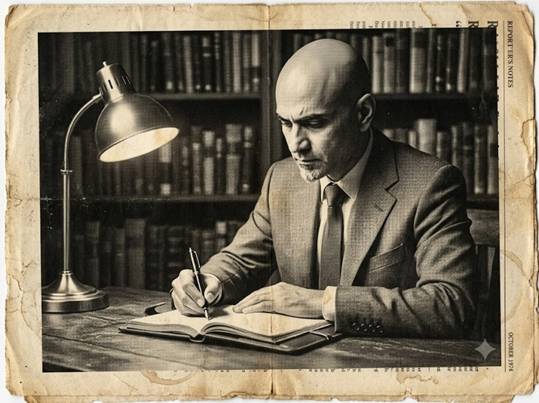

---
hide:
  - toc
---

# Résumé

<!-- The rest of your file stays exactly the same -->

<!-- PDF DOWNLOAD LINK -->
  

    <a href="/assets/resume.pdf" target="_blank" rel="noopener noreferrer" class="md-button md-button--primary">
      📄 View / Download PDF
    </a>
  

<article class="chronicle">

  

    
Special Edition &middot; Documentation &amp; Content Strategy

    <h1>The Documentation Daily</h1>
    
Senior Technical Writer &amp; Documentation Strategist

  

  

  

    Vol. XVIII &middot; No. 1
    Bangalore Edition
    Established 2003
  

  

  

    Location Bangalore, India
    &bull;
    Email <a href="mailto:arvind.modgal@outlook.com">arvind.modgal@outlook.com</a>
    &bull;
    Phone +91 9902029693
     
    Portfolio <a href="https://arvindmodgal.github.io/">arvindmodgal.github.io</a>
    &bull;
    LinkedIn <a href="https://www.linkedin.com/in/arvind-modgal-3705441ba">arvind-modgal-3705441ba</a>
  

  

  

    
15+ Years Bridging Enterprise Software &amp; Humans

    

      

        
        
Arvind Modgal at his desk, reviewing documentation architecture. <em>Bangalore, October.</em>

      

      

        Senior Technical Writer with over fifteen years of experience producing end-user
        documentation, online help systems, UI microcopy, and product content for software
        across banking, cybersecurity, and enterprise IT. Have led documentation teams,
        managed multi-project workloads, and collaborated closely with developers,
        architects, product managers, and QA. Background includes structured authoring,
        content reuse, style guide development, and localization coordination across
        global teams.
      

    

    

      <h3>Technical Specifications &amp; Core Competencies</h3>
      <dl>
        <dt>Documentation</dt>
        <dd>User guides, API docs, installation &amp; configuration manuals, release notes, context-sensitive online help, video tutorials, style guides</dd>
        <dt>UX &amp; Proposals</dt>
        <dd>UI microcopy, error messages, tooltips, screen flow guidance, RFIs, RFPs, solution documents, bid proposals, case studies, marketing collateral</dd>
        <dt>Tools</dt>
        <dd>Adobe RoboHelp, RoboSource Control, MS Office Suite, Adobe Photoshop, SharePoint, HTML, Jira, Confluence, WonderShare Video Editor, GIMP, Markdown</dd>
        <dt>Content Strategy</dt>
        <dd>Content reuse, template design, documentation planning, version control, localization coordination</dd>
        <dt>Leadership</dt>
        <dd>Team management, mentoring, project scheduling, peer reviews, stakeholder communication</dd>
        <dt>Methodologies</dt>
        <dd>Structured authoring, QA process documentation, ISO certification support, Agile/Scrum</dd>
      </dl>
    

  

  
Career Chronicles &amp; Field Reports

  
A record of assignments across banking, cybersecurity, and enterprise infrastructure

  

    

      <h4>Senior Technical Writer &mdash; Underwriters Laboratories (UL Solutions)</h4>
      Nov 2021 &ndash; Dec 2022 &middot; Agile/Scrum Framework
      <ul>
        <li>Worked within an Agile/Scrum framework, participating in sprint planning, standups, and reviews to align documentation deliverables with product release cycles.</li>
        <li>Developed user-facing content across multiple product touchpoints, including product names, UI labels, navigation elements, automated emails, and system notifications.</li>
        <li>Partnered with cross-functional teams of designers, researchers, product managers, and engineers to align content with product direction.</li>
        <li>Authored online user guides for the UL SafeCyber platform and produced video tutorials for end users, managers, and the marketing team.</li>
      </ul>
    

    

      <h4>Lead Technical Writer &mdash; Wipro Technologies Ltd.</h4>
      Jun 2012 &ndash; Mar 2019 &middot; Pre-Sales &amp; Global Infrastructure
      <ul>
        <li>Authored and reviewed RFI, RFP, solution documents, and marketing presentations in collaboration with Pre-Sales, Solution Architects, and SMEs.</li>
        <li>Edited bid-related content for grammar, style, technical accuracy, and alignment with corporate documentation standards.</li>
        <li>Built and maintained a reusable content library, reducing document creation time and improving consistency across deliverables.</li>
        <li>Created and applied standardized templates for bid and proposal documents across the global infrastructure services division.</li>
        <li>Designed graphics and presentations to communicate complex infrastructure concepts to non-technical audiences.</li>
        <li>Developed detailed case studies by gathering input from Sales, Delivery, and technical teams.</li>
      </ul>
    

    

      <h4>Lead Technical Writer &mdash; CustomerXPs Software Pvt. Ltd.</h4>
      Jun 2011 &ndash; May 2012
      <ul>
        <li>Established the company's first corporate style guide and documentation templates, delivering consistent branding and terminology across all product documentation.</li>
        <li>Authored end-user documentation including installation manuals, configuration guides, web-based user guides, administration guides, and release notes.</li>
        <li>Coordinated with the Release Management team to deliver documentation on schedule for each product release.</li>
        <li>Gathered and incorporated user and consultant feedback to improve documentation quality and usability.</li>
      </ul>
    

    

      <h4>Team Lead / Technical Writer &mdash; Financial Objects Pvt. Ltd. (TEMENOS)</h4>
      Jul 2004 &ndash; Feb 2011 &middot; Bangalore Development Centre
      
Founding member of the documentation team; grew the team from one to five technical writers.

      <ul>
        <li>Led end-to-end documentation for four major banking software products: IBIS, ActiveBank, Energy Credit, and a Wealth Management platform.</li>
        <li>Managed the documentation lifecycle for each project: requirements gathering, project planning, work delegation, writing, peer reviews, and final distribution.</li>
        <li>Wrote and maintained user guides, installation manuals, configuration references, release notes, and context-sensitive online help.</li>
        <li>Supervised, mentored, and evaluated six technical writers; supported professional development and ensured documentation quality standards.</li>
        <li>Coordinated localization with external translators for French, Swedish, and German versions of product documentation.</li>
        <li>Assisted development teams with UI microcopy including error messages, tooltips, and screen flow recommendations.</li>
        <li>Supported the QA team in preparing process documentation for ISO certification.</li>
        <li>Set up and maintained the SharePoint documentation intranet and contributed to corporate internet content.</li>
      </ul>
    

    

      <h4>Technical Content Developer &mdash; Hotriya Technology Services</h4>
      Jul 2003 &ndash; Jan 2004
      <ul>
        <li>Developed web-based tutorials and reference material on technical topics, such as 802.11 networking, Linux, and Visual FoxPro 8.0.</li>
      </ul>
    

  

  

    

      <h3>Education &amp; Certifications</h3>
      <ul>
        <li>Bachelor of Arts (B.A.) &mdash; Delhi University</li>
        <li>Microsoft Certified Professional (MCP) &mdash; NT Server 4, NT Workstation, NT Server 4 Enterprise</li>
        <li>Diploma in Software Management &mdash; Aptech</li>
      </ul>
    

    

      <h3>Notices &amp; Community</h3>
      <ul>
        <li>Indo-Canadian Youth Exchange Program, participant (Aug 2002 &ndash; Mar 2003)</li>
        <li>Volunteer writer, <em>Enterprise Bulletin</em> &mdash; a community newspaper in Collingwood, Ontario</li>
      </ul>
    

  

  

  
Printed and distributed by the Office of Arvind Modgal &middot; All rights reserved &middot; Reproduction by prospective employers encouraged

</article>

